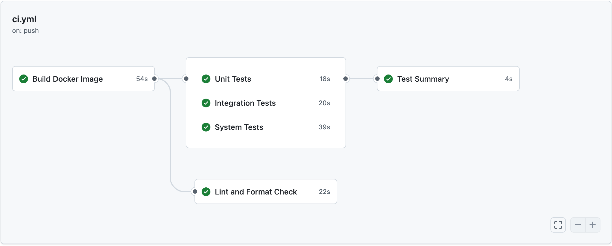

# Cheese App - CI Tutorial

In this tutorial we will setup Continuous Integration (CI) for a containerized Python API application. We'll learn how to automate code quality checks, testing, and build pipelines.

## Prerequisites
* Have Docker installed
* Python 3.9+ installed locally
* Git installed
* GitHub account

## Tutorial: Adding CI to the Cheese App

This tutorial demonstrates how to add automation to a Python FastAPI application using:
* **Pre-commit hooks** for local code quality checks (linting/formatting)
* **Pytest** for automated testing (unit & integration tests)
* **GitHub Actions** for remote CI pipelines
* **Docker** for containerized development and testing

### Clone the repository
- Clone or download from your repository

### Project Structure
```
cheese-app-ci-cd/
├── .pre-commit-config.yaml          # Pre-commit hooks configuration
├── .github/
│   └── workflows/
│       └── ci.yml                   # Main CI pipeline
├── Dockerfile                       # Container definition
├── docker-shell.sh                  # Start interactive container
├── docker-entrypoint.sh             # Container entrypoint
├── pyproject.toml                   # Python dependencies
├── pytest.ini                       # Pytest configuration
├── src/
│   └── api-service/
│       └── api/
│           ├── __init__.py
│           ├── service.py           # FastAPI application
│           └── utils.py             # Utility functions (power)
└── tests/
    ├── unit/
    │   └── test_utils.py            # Unit tests for utils
    ├── integration/
    │   └── test_api.py              # Integration tests (TestClient)
    └── system/
        └── test_system_api.py       # System tests (real HTTP)
```

---

## Part 1: Understanding the Codebase

Let's start by exploring the structure and functionality of our application.

### Explore the Project Structure

The main API is in `src/api-service/api/service.py`. This file contains:
- A FastAPI application with CORS middleware
- Three endpoints: `/`, `/health`, and `/euclidean_distance/`
- Uses a utility function `power()` from `api/utils.py`

The tests are organized in three levels:
- `tests/unit/` - Test individual functions in isolation
- `tests/integration/` - Test API endpoints using FastAPI TestClient
- `tests/system/` - Test the complete running system with real HTTP requests

### Run the Application

Let's see the API in action by running it locally with Docker.

1. **Build and start the Docker container**
```bash
sh docker-shell.sh
```

This will start an interactive bash shell inside the container.

2. **Start the Development Server**

Within the container, run:
```bash
uvicorn api.service:app --host 0.0.0.0 --port 9000 --reload
```

3. **Test the API**

Open your browser to:
- `http://localhost:9000` - Welcome message
- `http://localhost:9000/health` - Health check endpoint
- `http://localhost:9000/euclidean_distance/?x=3&y=4` - Calculate Euclidean distance (returns 5.0)

Please exit and remove your container after this, before starting with the next Part.
---

## Part 2: Identifying Code Quality Issues

Before we automate quality checks, let's manually check what issues exist in our codebase.

### Run Linters to Find Issues

Let's see what formatting and style issues exist:

**Option A: Check with Docker**
```bash
# Build the image first
docker build -t cheese-app-api:local .

# Check code quality
docker run --rm cheese-app-api:local flake8 --max-line-length=120 api/

# Check formatting with diff
docker run --rm cheese-app-api:local black --check --diff api/

```

**Option B: Check Locally (if Python installed)**
```bash
pip install black flake8

# Check code quality with Flake8
flake8 src/api-service/api/

# Check formatting issues with detailed diff view
black --check --diff src/api-service/api/

```

You'll see formatting inconsistencies and style issues. This shows why automation is important!

---

## Part 3: Testing with Pytest

### Test Structure - The Testing Pyramid

**Unit Tests** (`tests/unit/test_utils.py`):
- Test utility functions in isolation
- Test the `power()` function with various inputs
- Fast execution, no dependencies
- Example: `power(2, 3)` should return `8`
- **Run inside container**

**Integration Tests** (`tests/integration/test_api.py`):
- Test API endpoints using FastAPI TestClient
- Verify routing, validation, and response serialization
- Test integration between FastAPI and business logic
- No real HTTP server needed (uses TestClient)
- Example: `GET /euclidean_distance/?x=3&y=4` should return `5.0`
- **Run inside container in CI/CD**

**System Tests** (`tests/system/test_system_api.py`):
- Test the complete running system as a black box
- Make real HTTP requests to live server at `localhost:9000`
- Test the full HTTP stack end-to-end
- Most realistic, but slowest tests
- Example: `curl http://localhost:9000/euclidean_distance/?x=3&y=4`
- **Run in CI/CD and locally using Docker with --network host**

### Run Tests

All tests run inside Docker containers to ensure consistency with the CI environment.

#### Option 1: Run Unit & Integration Tests (Recommended)

These tests don't require a running server and can be executed directly:

```bash
# Build the image first
docker build -t cheese-app-api:local .

# Run unit tests only
docker run --rm cheese-app-api:local pytest tests/unit/ -v

# Run integration tests only
docker run --rm cheese-app-api:local pytest tests/integration/ -v

# Run both unit and integration tests
docker run --rm cheese-app-api:local pytest tests/unit/ tests/integration/ -v

# Run with coverage
docker run --rm cheese-app-api:local pytest tests/unit/ --cov=api --cov-report=term
```

#### Option 2: Run System Tests

System tests require a live server because they make real HTTP requests to test the complete system end-to-end:

```bash
# Build image first
docker build -t cheese-app-api:local .

# Start the API server
docker run -d --name api-server -p 9000:9000 -e DEV=1 cheese-app-api:local

# Run system tests against the live server
docker run --rm --network host cheese-app-api:local pytest tests/system/ -v

# Clean up when done
docker stop api-server && docker rm api-server
```

**Note:** System tests will skip if the server isn't running at `http://localhost:9000`.

#### Option 3: Interactive Container Workflow

For development, you can run tests inside an interactive container:

```bash
# Start interactive container
sh docker-shell.sh
```

Within the container, run:
```bash
# Run unit tests
pytest tests/unit/ -v

# Run integration tests
pytest tests/integration/ -v

# Run both
pytest tests/unit/ tests/integration/ -v

# Run with coverage
pytest tests/unit/ --cov=api --cov-report=html
```

**Note:** For system tests in this workflow, you'll need to start the server in another terminal first (see Option 2).

---

## Part 4: Automating with Pre-commit Hooks

Pre-commit hooks run automatically before each commit to catch issues early.

### Install Pre-commit Framework

Outside the container:
```bash
pip install pre-commit
```

### Install the Hooks
```bash
# From the root directory
pre-commit install
```

This installs Git hooks that will run automatically before each commit.

### Run the Hooks

After installation, the hooks will run automatically every time you commit:
```bash
git commit -m "Your commit message"
# Pre-commit hooks will run automatically!
```

Alternatively, you can run the hooks manually without committing:
```bash
# Run on all files
pre-commit run --all-files

# Or run on staged files only
pre-commit run
```

### What Gets Checked?
- **trailing-whitespace**: Remove trailing spaces
- **end-of-file-fixer**: Ensure files end with newline
- **check-yaml**: Validate YAML syntax
- **black**: Auto-format Python code (120 char lines)
- **flake8**: Check Python code quality

---

## Part 5: GitHub Actions (Remote CI)

All CI tests run inside Docker containers using Python 3.11 (same as production), ensuring complete consistency between local development, CI, and production environments.

### CI Pipeline (`.github/workflows/ci.yml`)

The CI pipeline is defined in `.github/workflows/ci.yml` and runs automatically on every push and pull request to the `main` and `develop` branches.

#### Understanding the Pipeline Structure

The pipeline consists of **6 jobs** that run in parallel (except for dependencies):

1. **Build Job** (`build`):
   - Builds the Docker image once
   - Uses Docker Buildx for efficient caching
   - Tags the image with the Git commit SHA (`github.sha`) for uniqueness
   - Saves the image as a tar file and uploads it as an artifact
   - This ensures all other jobs use the exact same Docker image

2. **Lint and Format Job** (`lint-and-format`):
   - **Depends on**: `build` job
   - Downloads the Docker image from artifacts
   - Runs Black formatter check to ensure code formatting consistency
   - Runs Flake8 linter to check code quality and style issues
   - Uses `continue-on-error: true` for Flake8 to allow warnings without failing

3. **Unit Tests Job** (`unit-tests`):
   - **Depends on**: `build` job
   - Downloads the Docker image
   - Runs unit tests in isolation (no external dependencies)
   - Generates coverage reports (terminal, XML, and HTML formats)
   - Uploads coverage report as an artifact for later review

4. **Integration Tests Job** (`integration-tests`):
   - **Depends on**: `build` job
   - Downloads the Docker image
   - Tests API endpoints using FastAPI's TestClient
   - Verifies routing, validation, and response serialization

5. **System Tests Job** (`system-tests`):
   - **Depends on**: `build` job
   - Downloads the Docker image
   - Starts the API server in a container (`docker run -d`)
   - Waits for the server to be ready (health check with `curl`)
   - Runs system tests against the live server using `--network host`
   - Always shows server logs for debugging
   - Always stops and removes the server container (cleanup)

6. **Test Summary Job** (`test-summary`):
   - **Depends on**: All three test jobs
   - Runs even if tests fail (`if: always()`)
   - Checks the results of all test jobs
   - Prints a summary of which tests passed/failed
   - Fails the pipeline if any test job failed

#### Key CI/CD Concepts

**Artifact Sharing**: The Docker image is built once and shared across all jobs using GitHub's artifact system. This is more efficient than rebuilding the image for each job.

**Parallel Execution**: Jobs 2-5 run in parallel after the build completes, speeding up the pipeline.

**Conditional Execution**: The `if: always()` ensures cleanup steps run even if tests fail.

**Unique Image Tags**: Using `github.sha` ensures each commit gets a unique image tag, preventing conflicts.

**Network Modes**: System tests use `--network host` so the test container can access the server at `localhost:9000`.

### Push to GitHub
```bash
git add .
git commit -m "Add CI pipeline"
git push
```

### Watch GitHub Actions

1. Go to your GitHub repository
2. Click the "Actions" tab
3. See workflows running automatically
4. Green checkmark = success ✅
5. Red X = failure ❌

### CI Pipeline in Action

Here's what the pipeline looks like when running on GitHub:



The image shows all the jobs running in parallel after the build completes, demonstrating the efficient workflow structure.

---

## Part 6: Branch Protection (Optional)

### Configure Branch Rules

1. Go to **Settings** → **Branches** → **Add rule**
2. Branch name pattern: `main`
3. Enable:
   - ☑ Require a pull request before merging
   - ☑ Require status checks to pass before merging
   - Select: `lint-and-format`, `unit-tests`, `integration-tests`, `system-tests`
4. Save changes

### Test the Protection

```bash
# Create a new branch
git checkout -b feature/test-protection

# Make a change that breaks tests
echo "def broken(): assert False" >> tests/unit/test_utils.py

# Commit and push
git add .
git commit -m "Intentionally break tests"
git push origin feature/test-protection

# Create a pull request on GitHub
# You'll see: ❌ Tests must pass before merging!
```

---

## Part 7: Student Exercise - Add a New Endpoint with Full CI

1. **Add a new endpoint** to `src/api-service/api/service.py`:

```python
@app.get("/add/")
async def add_numbers(x: float = 0, y: float = 0):
    """Add two numbers"""
    return {"result": x + y}
```

2. **Write integration test** in `tests/integration/test_api.py`:

```python
def test_add_endpoint():
    response = client.get("/add/?x=10&y=20")
    assert response.status_code == 200
    assert response.json()["result"] == 30
```

3. **Test in Docker**:

Run tests using Docker (same format as CI pipeline):
```bash
# Build the image first
docker build -t cheese-app-api:local .

# Run all tests
docker run --rm cheese-app-api:local pytest tests/ -v

# Run specific test types
docker run --rm cheese-app-api:local pytest tests/unit/ -v
docker run --rm cheese-app-api:local pytest tests/integration/ -v
```

Check formatting and auto-format:
```bash
# Check formatting
docker run --rm cheese-app-api:local black --check --line-length 120 api/

# Auto-format code
docker run --rm -v $(pwd)/src/api-service:/app cheese-app-api:local black --line-length 120 api/
```

4. **Push to GitHub**:

```bash
git add .
git commit -m "Add addition endpoint with tests"
git push
```

5. **Watch CI pipeline run automatically**

---

## Quick Command Reference

### Docker-First Workflow (Recommended - Matches CI)
```bash
# Build Docker image
docker build -t cheese-app-api:local .

# Run tests (same commands used in CI)
docker run --rm cheese-app-api:local pytest tests/unit/ -v
docker run --rm cheese-app-api:local pytest tests/integration/ -v
docker run --rm cheese-app-api:local pytest tests/ -v

# Run system tests (requires running server)
# First, start server in one terminal:
docker run -d --name api-server -p 9000:9000 -e DEV=1 cheese-app-api:local
# Then run system tests:
docker run --rm --network host cheese-app-api:local pytest tests/system/ -v
# Stop server when done:
docker stop api-server && docker rm api-server

# Run linting (same commands used in CI)
docker run --rm cheese-app-api:local black --check --line-length 120 api/
docker run --rm cheese-app-api:local flake8 --max-line-length=120 api/

# Start development server
sh docker-shell.sh
# Inside container: uvicorn api.service:app --host 0.0.0.0 --port 9000 --reload
```

### Interactive Container Workflow
```bash
# Start interactive Docker container
sh docker-shell.sh

# Inside the container:
uvicorn api.service:app --host 0.0.0.0 --port 9000 --reload  # Start server
pytest tests/unit/ -v                                        # Run unit tests
pytest tests/integration/ -v                                 # Run integration tests
black --check api/                                           # Check formatting
black api/                                                   # Auto-format
```

### Run Locally Without Docker (Requires Python Installation)
```bash
# Code Quality Checks
python3 -m flake8 src/api-service/api/                     # Run linter
python3 -m black --check src/api-service/api/              # Check formatting
python3 -m black src/api-service/api/                      # Auto-format code

# Pre-commit Hooks
pip install pre-commit                                      # Install framework
pre-commit install                                          # Setup hooks
pre-commit run --all-files                                 # Run all checks

# Testing (requires PYTHONPATH setup)
PYTHONPATH=src/api-service pytest tests/unit/ -v          # Unit tests
PYTHONPATH=src/api-service pytest tests/integration/ -v   # Integration tests
```

---

## Troubleshooting

### Issue: Pre-commit hooks not running
```bash
pre-commit install
```

### Issue: Black formatting conflicts
```bash
# If Black and your editor disagree, trust Black:
python3 -m black src/api-service/api/

# To see what Black will change before applying:
python3 -m black --check --diff src/api-service/api/
```

### Issue: Tests fail locally
```bash
# Make sure you're in the project root
pytest tests/ -v

# Run with more verbose output:
pytest tests/ -vv --tb=long

# Run specific test file:
pytest tests/integration/test_api.py -v
```

### Issue: Docker build fails
```bash
docker build -t cheese-app-test . --no-cache
```

### Issue: Can't access API at localhost:9000
```bash
# Check if container is running
docker ps

# Check logs
docker logs <container-name>
```

### Issue: GitHub Actions failing
- Check the "Actions" tab for detailed logs
- Common issue: Missing dependencies in pyproject.toml
- Common issue: Wrong file paths in workflow
- Common issue: Black/Flake8 version mismatch between local and CI

---

## Docker Cleanup

### Make sure we do not have any running containers and clear up unused images
* Run `docker container ls`
* Stop any container that is running
* Run `docker system prune`
* Run `docker image ls`
